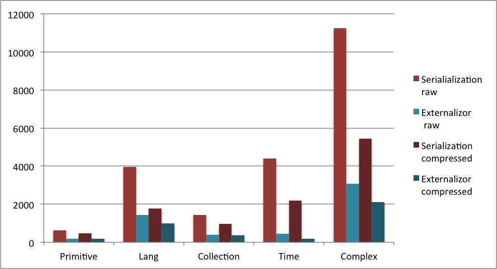
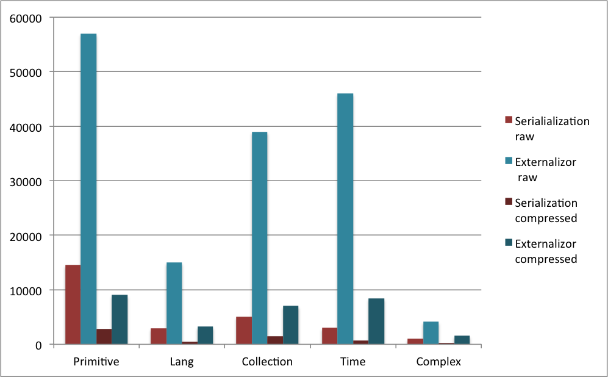

# Externalizor

[](https://travis-ci.org/qwazr/externalizor)
[](https://maven-badges.herokuapp.com/maven-central/com.qwazr/externalizor)
[](https://coveralls.io/github/qwazr/externalizor?branch=master)
[](http://www.javadoc.io/doc/com.qwazr/externalizor)

Efficient (fast and small) Java serialization using Externalizable interface.

- Concrete Collections (Map, Set, Vector, List) with compression/decompression using [Snappy](https://github.com/xerial/snappy-java)
- Primitive types: int, long, short, double, float, boolean, char, byte, enum
- Primitive array: with compression/decompression using [Snappy](https://github.com/xerial/snappy-java)
- Time types: Date, LocalDate, LocalTime, LocalDateTime, Instant, Duration, Period, MonthDay, Year

## Usage

Use the provided static methods to serialize and/or deserialize your object(s). 

```java

// Serialization with compression

MyClass myClass = new MyClass();
try (ByteArrayOutputStream output = new ByteArrayOutputStream()) {
    Externalizor.serialize(object, output);
}

// Deserialization with compression

try (ByteArrayInputStream input = new ByteArrayInputStream(bytes)) {
    MyClass myClass = Externalizor.deserialize(input);
}

// Serialization without compression

MyClass myClass = new MyClass();
try (ByteArrayOutputStream output = new ByteArrayOutputStream()) {
    Externalizor.serializeRaw(object, output);
}

// Deserialization without compression

try (ByteArrayInputStream input = new ByteArrayInputStream(bytes)) {
    MyClass myClass = Externalizor.deserializeRaw(input);
}
```

## Maven dependency

In Maven's central repository:
[central.maven.org/maven2/com/qwazr/externalizor](http://central.maven.org/maven2/com/qwazr/externalizor)

Add the following dependency to your pom.xml:

```xml
<dependency>
    <groupId>com.qwazr</groupId>
    <artifactId>externalizor</artifactId>
    <version>1.3</version>
</dependency>
```

## Benchmark

The code of the benchmark is here:
[BenchmarkTest](src/test/java/com/qwazr/externalizor/BenchmarkTest.java)

- Serialization raw: Default Java serialization without compression.
- Serialization compressed: Default Java serialization with Gzip compression.
- Externalizor raw: Using Externalizor without compression.
- Externalizor compressed: Using Externalizor with Gzip compression.

### Average size of the serialized objects

Bytes sizes. Smaller is better.



### Serialization/Deserialization rate

Number of serialization and deserialization per seconds. Bigger is better.



## Issues

Post bug reports or feature request to the Issue Tracker:
https://github.com/qwazr/externalizor/issues

## Open source license

[Apache2 license](https://github.com/qwazr/externalizor/blob/master/LICENSE)

